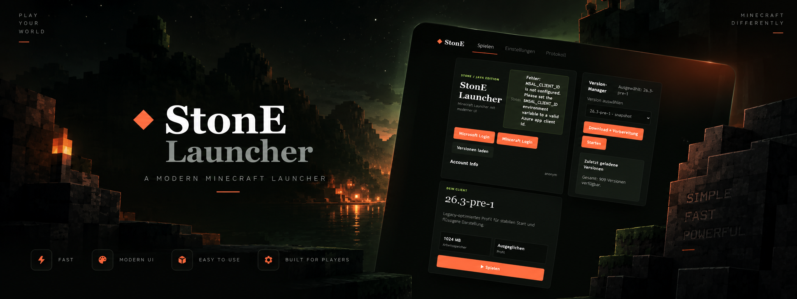
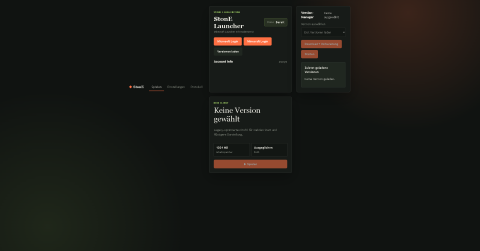
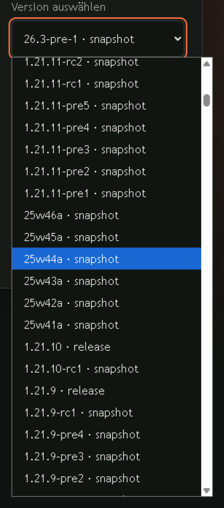
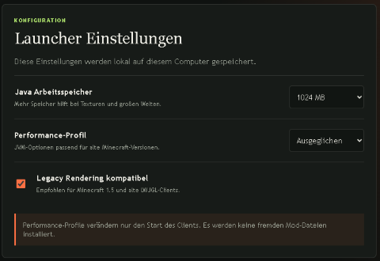

# 🪨 StonE Launcher

<p align="center">
  
</p>

<p align="center">
  <strong>A fresh, modern Minecraft launcher built for a better way to play.</strong>
</p>

<p align="center">
  <a href="#features">Features</a> •
  <a href="#screenshots">Screenshots</a> •
  <a href="#installation">Installation</a> •
  <a href="#roadmap">Roadmap</a> •
  <a href="#contributing">Contributing</a>
</p>

<p align="center">
  
  
  
  
</p>

---

## 🎮 About

**StonE Launcher** is a brand-new Minecraft launcher designed from the ground up with a modern interface, clean design, and a simple user experience.

Instead of feeling like another outdated launcher, StonE Launcher focuses on making Minecraft management feel **fast, clean, and intuitive**.

From selecting your Minecraft version to launching the game, everything is designed around keeping the experience simple.

> **StonE Launcher — A new way to launch Minecraft.**

---

## ✨ Features

### 🎨 Modern UI

A completely redesigned launcher experience with a clean and modern interface.

### ⚡ Fast & Lightweight

Designed to start quickly and stay responsive without unnecessary complexity.

### 🎮 Minecraft Version Management

Easily manage and select the Minecraft versions you want to play.

### 👤 Account Management

Keep your Minecraft account information organized directly inside the launcher.

### 🚀 One-Click Launch

Select your configuration and launch Minecraft with minimal effort.

### 🧩 Customization

Built with customization in mind, allowing future features such as custom themes, backgrounds, and launcher settings.

### 🔄 Regular Updates

StonE Launcher is actively being developed with new features and improvements planned.

---

# 📸 Screenshots

> Screenshots will be added as development progresses.

### Main Launcher

<p align="center">
  
</p>

### Minecraft Selection

<p align="center">
  
</p>

### Settings

<p align="center">
  
</p>

---

# 📥 Installation

## Windows

### Option 1 — Release

1. Open the **Releases** section of this repository.
2. Download the latest StonE Launcher release.
3. Extract the downloaded archive if necessary.
4. Start `StonELauncher.exe`.
5. Follow the setup instructions.
6. Select your Minecraft version and launch the game.

### Option 2 — Build From Source

Clone the repository:

```bash
git clone https://github.com/YOUR_USERNAME/stonE-launcher.git
```

Enter the project directory:

```bash
cd stonE-launcher
```

Install the required dependencies:

```bash
npm install
```

Start the launcher:

```bash
npm start
```

> **Note:** Build instructions may change while StonE Launcher is still in development.

---

# 🗺️ Roadmap

StonE Launcher is still actively being developed.

### ✅ Completed

* [x] Initial launcher concept
* [x] New launcher UI
* [x] Basic Minecraft launching
* [x] Initial project structure

### 🚧 In Progress

* [ ] Improved account management
* [ ] Minecraft version management
* [ ] Launcher settings
* [ ] Performance improvements
* [ ] UI/UX improvements

### 🔮 Planned

* [ ] Microsoft account authentication
* [ ] Custom launcher themes
* [ ] Custom backgrounds
* [ ] Mod support
* [ ] Modpack support
* [ ] Fabric / Forge support
* [ ] Automatic Minecraft installation
* [ ] Automatic launcher updates
* [ ] More customization options
* [ ] Better error handling
* [ ] Multi-language support

---

# 🛠️ Technology

StonE Launcher is built using modern development technologies.

> **Technologies used will depend on the current version of the project.**

Examples:

* JavaScript / TypeScript
* HTML & CSS
* Node.js
* Minecraft APIs
* Electron *(if applicable)*

---

# 📂 Project Structure

```text
stonE-launcher/
│
├── assets/
│   ├── banner.png
│   └── screenshots/
│       ├── main.png
│       ├── versions.png
│       └── settings.png
│
├── src/
│   └── ...
│
├── README.md
├── LICENSE
└── package.json
```

---

# 🤝 Contributing

Contributions, ideas, and suggestions are welcome.

If you want to contribute:

1. Fork the repository.
2. Create a new branch.

```bash
git checkout -b feature/my-feature
```

3. Make your changes.
4. Commit your changes.

```bash
git commit -m "Add my feature"
```

5. Push your branch.

```bash
git push origin feature/my-feature
```

6. Open a Pull Request.

---

# 🐛 Bug Reports & Suggestions

Found a bug or have an idea?

Open an **Issue** and include:

* What happened
* What you expected to happen
* Steps to reproduce the issue
* Your StonE Launcher version
* Your operating system
* Screenshots or logs if available

---

# 📜 License

This project is licensed under the **MIT License**.

See the [`LICENSE`](LICENSE) file for more information.

---

# ⭐ Support the Project

If you like **StonE Launcher**, consider giving the repository a ⭐.

It helps support the project and shows that you'd like to see StonE Launcher continue to grow.

<p align="center">

### 🪨 StonE Launcher

**Launch Minecraft differently.**

</p>
